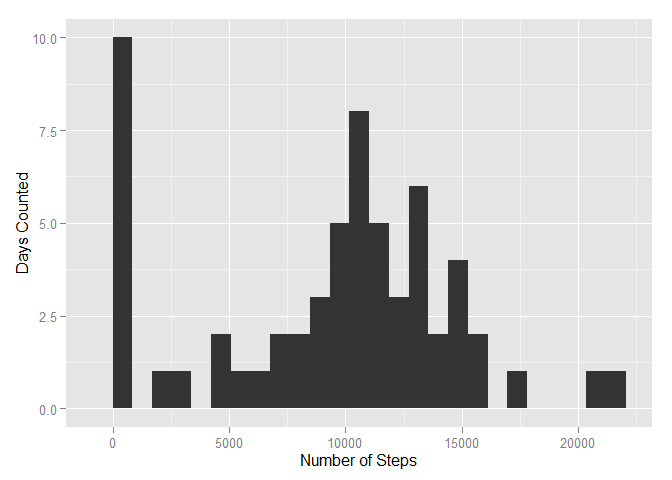

# Reproducible Research: Peer Assessment 1


## Loading and preprocessing the data

```r
## If activity.csv hasn't been extracted, do so.

if (!("activity.csv" %in% list.files())) {
  unzip("activity.zip");
}
rawData <- read.csv("activity.csv");

library('ggplot2');

## Filter out rows with NA values.

withoutNA <- rawData[complete.cases(rawData),];


## Group data by date.

byDate <- split(withoutNA, withoutNA$date)
dateVector <- unlist(lapply(byDate, function(d){sum(d[,1])}));
byDateFrame <- data.frame(sums = dateVector, dates = names(dateVector), row.names = NULL);
```


## What is mean total number of steps taken per day?


```r
meanByDate <- mean(byDateFrame[,1]);
medianByDate<- median(byDateFrame[,1]);
ggplot(data = byDateFrame, aes(byDateFrame[,1])) + 
  geom_histogram(binwidth = range(byDateFrame[,1])[[2]]/25) + 
  xlab("Number of Steps") + 
  ylab("Days Counted")
```

 

The mean number of steps per day is **9354.2295082**, while the median is **10395**.

## What is the average daily activity pattern?


```r
library('plyr');

# Group data by interval and take the mean.

byInterval <- ddply(withoutNA,~interval, function(i){mean(i$steps)});
names(byInterval) <- c("interval", "steps");

ggplot(data = byInterval, aes(interval, steps)) + geom_line();
```

 

The interval with the most activity is given by the following: 


```r
byInterval[which(byInterval[,2] == max(byInterval[,2])),];
```

```
##     interval    steps
## 104      835 206.1698
```


## Imputing missing values

```r
numIncompleteRows <- sum(!complete.cases(rawData));

## Take the number of steps for rows with NA values from the byInterval data frame.

imputeSteps <- as.vector(by(rawData, seq_len(nrow(rawData)), function(obs) {
  if (!is.na(obs$steps)) {
    obs$steps
  } else {
    byInterval[which(byInterval[,"interval"] == obs[,"interval"]),][["steps"]];
  }
}));

## Save the new data set with imputed values as the data frame imputedData.

imputedData <- data.frame(steps = imputeSteps, date = rawData[["date"]], interval = rawData[["interval"]]);

## Group data with imputed by date.

byDateImputed <- split(imputedData, imputedData$date)
dateVectorImputed <- unlist(lapply(byDateImputed, function(d){sum(d[,1])}));
byDateFrameImputed <- data.frame(sums = dateVectorImputed, dates = names(dateVectorImputed), row.names = NULL);

meanByDateImputed<- mean(byDateFrameImputed[,"sums"]);
medianByDateImputed <- median(byDateFrameImputed[,"sums"]);
```

There are **2304** rows with NA values. The mean number of steps is **1.0766189\times 10^{4}** and the median is **1.0766189\times 10^{4}** steps, versus **9354.2295082** and **10395** without imputed values, respectively.

## Are there differences in activity patterns between weekdays and weekends?


```r
## Classify each day as coming from a weekend or a weekday.

dateFactor <- as.factor(sapply(imputedData$date, function(d){
  day <- weekdays(as.Date(d))
  if (day == "Saturday" || day == "Sunday") {
    "weekend";
  } else {"weekday";}
}))
imputedData <- cbind(imputedData, dateFactor);
names(imputedData) <- c("steps", "date", "interval", "weekday");

byIntervalWeekday <- ddply(imputedData,c("interval", "weekday"), function(i){mean(i$steps)});
names(byIntervalWeekday) <- c("interval", "weekday", "steps");

ggplot(data = byIntervalWeekday, aes(interval, steps)) + geom_line() + facet_grid(weekday ~ .);
```

 

On average, weekdays have the highest peak in number of steps in an interval, then steadily going down to peak at 100 for the rest of the day; in contrast, weekends peak (on average) at around 150 steps, going slightly lower than that as the day progresses.
